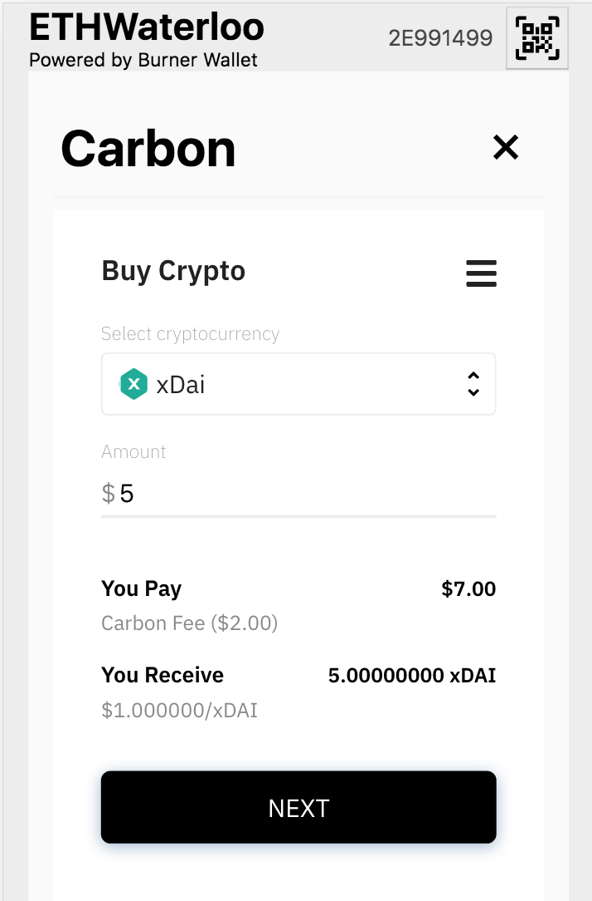

# Carbon Plugin for Burner Wallet

Purchase crypto with credit cards inside a Burner Wallet.



## Usage

Install package:

```
yarn add @burner-wallet/carbon-plugin
```

Add plugin to Burner Wallet. Be sure to add your key to the CarbonPlugin constructor.

```javascript
import React from 'react';
import ReactDOM from 'react-dom';
import { xdai, dai, eth } from '@burner-wallet/assets';
import BurnerCore from '@burner-wallet/core';
import { InjectedSigner, LocalSigner } from '@burner-wallet/core/signers';
import { InfuraGateway, InjectedGateway, XDaiGateway } from '@burner-wallet/core/gateways';
import ModernUI from '@burner-wallet/modern-ui';
import CarbonPlugin from '@burner-wallet/carbon-plugin';

const core = new BurnerCore({
  signers: [new InjectedSigner(), new LocalSigner()],
  gateways: [
    new InjectedGateway(),
    new InfuraGateway(process.env.REACT_APP_INFURA_KEY),
    new XDaiGateway(),
  ],
  assets: [xdai, dai, eth],
});


const BurnerWallet = () =>
  <ModernUI
    core={core}
    plugins={[new CarbonPlugin('<key from Carbon>', 'production')]}
  />

ReactDOM.render(<BurnerWallet />, document.getElementById('root'));

```
